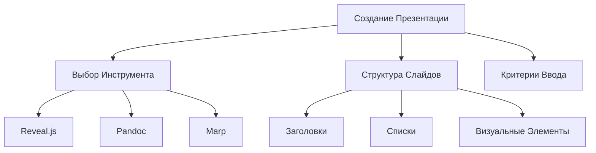

## Что такое Markdown?

[Markdown](https://habitica.fandom.com/ruwiki%D0%A8%D0%BF%D0%B0%D1%80%D0%B3%D0%B0%D0%BB%D0%BA%D0%B0_%D0%BF%D0%BE_Markdown)  — это *легковесный язык разметки*, предназначенный для форматирования текста. Он позволяет быстро и просто создавать структурированные документы, которые затем можно конвертировать в HTML, PDF и другие форматы. Markdown был создан Джоном Грубером в 2004 году с целью сделать написание для интернета более удобным и читаемым.


Вот обновленная статья о создании презентаций в формате Markdown с добавлением эмоджи и информации о форматировании текста.

## Создание Презентаций в Формате Markdown 🌟

Презентации — это мощный инструмент для передачи информации. Использование Markdown для их создания может упростить процесс благодаря простому и лаконичному синтаксису. Ниже приведены рекомендации и примеры для создания эффективных презентаций в Markdown.

### Зачем использовать Markdown для презентаций? 🤔

- **Простота**: Легкий в освоении синтаксис, который позволяет сосредоточиться на содержании, а не на форматировании.
- **Совместимость**: Markdown легко конвертируется в HTML, PDF и другие форматы.
- **Инструменты**: Существует множество инструментов и библиотек для создания слайдов из Markdown.

### Инструменты для создания презентаций 🛠️

1. **Reveal.js**: Позволяет создавать красивые и интерактивные презентации на основе HTML. Markdown можно использовать для упрощения процесса.
2. **Pandoc**: Мощный инструмент для конвертации файлов. Позволяет преобразовать Markdown в множество форматов, включая PDF и HTML.
3. **Marp**: Позволяет создавать презентации прямо из Markdown-файлов и поддерживает интеграцию с Visual Studio Code.

### Критерии ввода 📝

При создании презентаций в формате Markdown важно учитывать следующие критерии:

1. **Четкость и краткость**: Каждое сообщение должно быть ясным и кратким, чтобы аудитория могла легко его воспринять.
2. **Структура**: Используйте заголовки и подзаголовки для четкого разделения тем.
3. **Использование списков**: Списки помогают разбить текст и делают его более удобочитаемым.
4. **Визуальные элементы**: Изображения и диаграммы могут улучшить восприятие и зрительно отразить ключевые моменты.

### Форматирование текста ✍️

Markdown поддерживает различные способы форматирования текста:

- **Жирный текст**: Для жирного текста используйте двойные звездочки или подчеркнутые символы. Например, `**жирный текст**` или `__жирный текст__` будет отображаться как **жирный текст**.
  
- **Курсив**: Для курсива используйте одинарные звездочки или подчеркнутые символы. Например, `*курсив*` или `_курсив_` станет *курсивом*.
  
- **Заголовки**: Используйте решетку (#) перед текстом, чтобы создать заголовки. Например:
  - `# Заголовок 1`
  - `## Заголовок 2`
  - `### Заголовок 3`
  
- **Списки**: Используйте дефисы или звездочки для создания неупорядоченных списков. Для упорядоченных списков используйте числа. Например:
  ```
  - Пункт 1
  - Пункт 2
  ```
  
  или
  ```
  1. Первый пункт
  2. Второй пункт
  ```

### Пример структуры презентации в Markdown

Вот пример структуры слайдов:

```markdown
# Заголовок Презентации

--- 

## Слайд 1: Введение

- Краткое представление темы
- Цели и задачи

---

## Слайд 2: Основная идея

1. Первый пункт
2. Второй пункт

---

## Слайд 3: Заключение

- Основные выводы
- Планы на будущее
```

### Интересная диаграмма 📊

Вот диаграмма, отображающая структуру создания презентации:



### Заключение 🎉

Создание презентаций в формате Markdown — это удобный и эффективный способ систематизировать информацию. Используйте указанные инструменты и советы, чтобы сделать свои презентации более привлекательными и доступными для аудитории.

Если у вас есть вопросы или необходимые уточнения, не стесняйтесь спрашивать! 

## Did you find this page helpful? Consider sharing it 🙌
